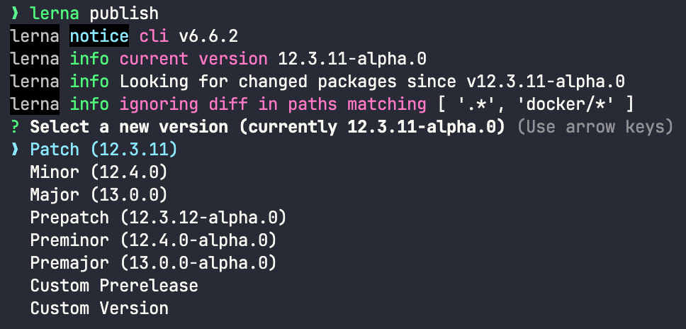
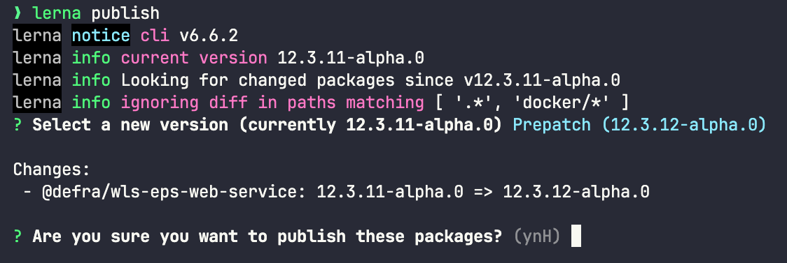
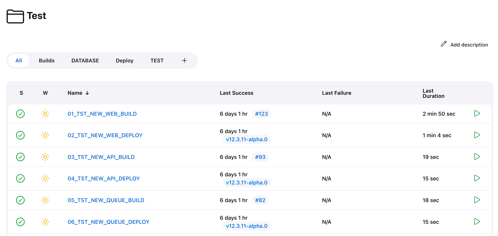
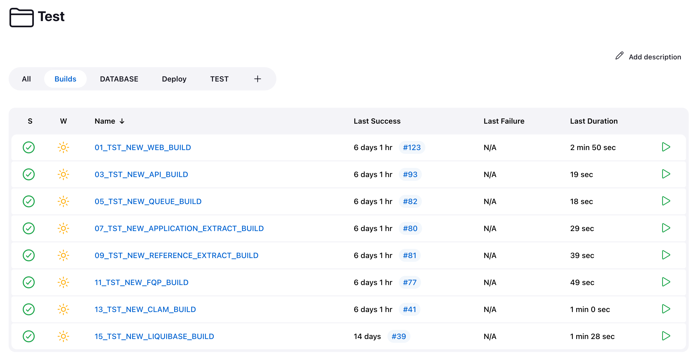
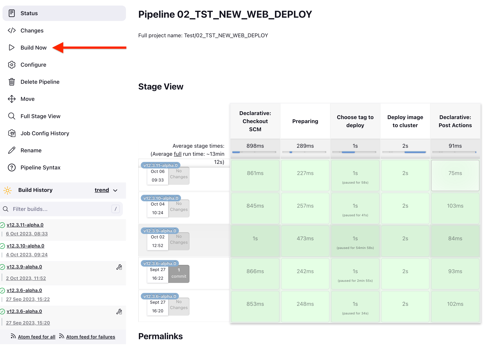
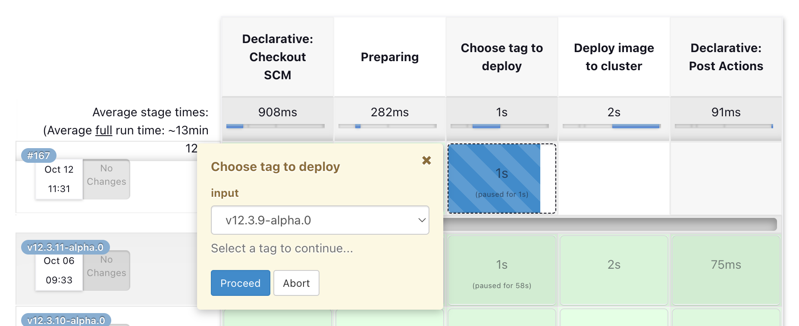

# Releasing

> This guide assumes we intend to deploy a release candidate version to test. It will be updated in future to cover other environments and non-RC releases.

We use [Lerna](https://lerna.js.org/) to version and publish our code to [npm](https://www.npmjs.com/). Once the version has been updated, we build images for each service using a series of Jenkins jobs. Finally, we deploy these images, again using Jenkins.

## Prerequisites

You will need:

* Lerna v6 installed globally. The `lerna bootstrap` command we rely on for getting up and running locally is deprecated as of v7 so for the time being we stick with v6 which can be installed globally with `npm install -g lerna@6`.
* An npm account with the required access to publish to the Defra npm group. If you don't have this access, contact the principal dev with your npm username to request the access. Once access is confirmed, go to your `wildlife-licencing` folder, enter the command `npm adduser` and follow the directions to configure npm.
* Access to our [Jenkins instance](https://new-jenkins.aws-int.defra.cloud/) and the ability to run the build and deploy jobs. If you don't have this access, contact webops to request it.
* The ability to make changes to our JIRA board. If you don't have this access, contact the delivery manager to request it.

## Publishing

At present, all projects within the monorepo are published to npm.

When we publish, we bump the overall version of the monorepo. Any projects which have changed since the last time we published will have their version numbers bumped to match. Say for example we are moving to version `12.3.2-alpha.0`. If we are publishing changes to a project with version `9.2.10` and a project with version `12.1.1-alpha.0`, they will both have their version numbers bumped to the overall monorepo version, ie. `12.3.2-alpha.0`.

Before publishing, we first check whether there are any outstanding PRs which could be merged into the `develop` branch, and merge them if there are.

Ensure the local repo is up to date with `develop`.

In the `wildlife-licencing` folder, run the command:

```
lerna publish
```

A list of version numbers will be shown corresponding to a major, minor or patch bump. Select the appropriate version, noting that as this is to be a release candidate it should be a version number ending `-alpha.0`. Note this version number for later!



The projects to be published will be shown. Ensure these are correct and then answer `y` to start the publishing process.



While publishing is taking place, go to the JIRA board and under Development > Releases, update the build version number to the one we noted.

> If publishing fails, you may have staged commits which you should unstage and discard changes. Then try `lerna publish from-package` which will attempt to publish any projects whose version doesn't exist in npm; alternatively, `lerna publish from-git` will attempt to publish any projects tagged in the latest commit.

Once publishing has completed successfully, we can move on to the build stage.

## Building

Go to our [Jenkins instance](https://new-jenkins.aws-int.defra.cloud/) and log in.

Go the folder corresponding to the environment we're deploying to; as we are deploying a release candiate to the test environment, we want the test folder.



Go to the Build tab and run all the build jobs. These don't require manual intervention and can all be run at the same time, so just click down through the "play" icons on the right.

> We build images for everything, regardless of whether or not they have changed since the last version.



The build jobs will build a docker image for each service and add it to our Amazon ECR (Elastic Container Registry).

> For consistency, the built images are given the overall monorepo version number, regardless of the project's actual version.

Once the build jobs have completed, we can move on to the deploy stage.

## Deployment

> Before we deploy, we should check with our QA colleagues to ensure they are happy for us to deploy. If they're in the middle of testing we may need to wait before we start.

Staying within Jenkins, go to the Deploy tab. These jobs require user input so cannot be run by clicking down through the "play" icons.

Click into the first job and select Build Now on the left.



After a moment you will be prompted to select the image to be deployed.



> The prompt doesn't always appear automatically; you may need to click within the window or even the middle box to give it focus and display the prompt.

> The latest version is often, but not always, within the first few tags listed. If it isn't immediately clear where it is then (depending on your browser and OS) if you have the list of tags displayed, you may be able to start typing the version number (remembering the initial `v`) to jump to it.

Select the required version and allow the job to complete, then move on to the next job.

> As with releasing we deploy everything, regardless of whether there has been a change since the last version.

Assuming we're releasing to enable QA to test our changes, we should now ping them to let them know that the test environment is now running the latest release.
